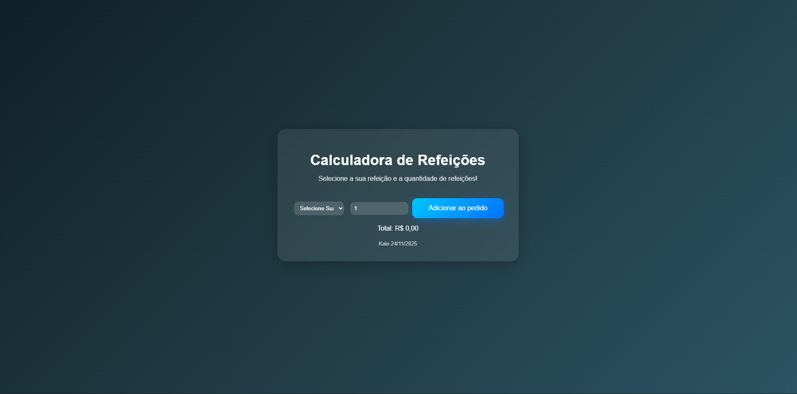

# Calculadora de Refeições

## 🌐 Função
Este site serve para a contabilidade de refeições pedidas pelos usuarios.

---

## Captura de Tela

---

## 🛠 Tecnologias utilizadas
- </>HTML5
- 🎨CSS3
- ♨️JavaScript (ES6+)
- 🆚VS Code
- 👩🏻‍💻Git e GitHub
- 🌐Navegador Google Chrome (para testes)

---

 ## 🚀 Como usar
- Baixe ou clone o projeto
- git clone https://github.com/seu-usuario/seu-repositorio.git
- Abra o arquivo:
- index.html
## O site abrirá automaticamente no navegador.

---

## Autor
* Desenvolvido por Kaio  
* Turma de Tecnologia em Informática para internet (Turno matutino) – Senac DF
